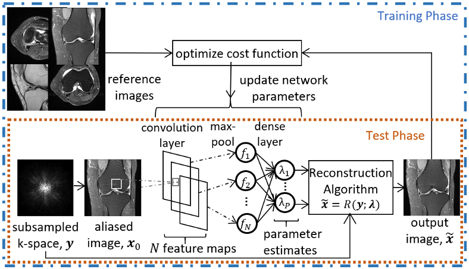

# Fast Automatic Parameter Selection for MRI Reconstruction
This repository contains the implementation of the regularization parameter tuning framework for model-based image reconstruction proposed in the paper "Fast Automatic Parameter Selection for MRI Reconstruction". 

In the paper, we have shown the tuning of two regularization parameters of the
TLMRI reconstruction algorithm (we tune 'error threshold' parameter in the first and last TL iterations). The code of the TLMRI algorithm is available at the 'transform learning and applications software' package available at 
http://transformlearning.csl.illinois.edu/software/. The downloaded TLMRI reconstruction code should be put in the TLMRI directory given here. 

The train and test code for the network have been kept in two separate directories. 
For training, run the 'main_train.m' script
and for testing, run the 'demo_test.m' script

## Citation
#### T. T. Toma and D. S. Weller, "Fast Automatic Parameter Selection for MRI Reconstruction," 2020 IEEE 17th International Symposium on Biomedical Imaging (ISBI), Iowa City, IA, USA, 2020, pp. 1078-1081, doi: 10.1109/ISBI45749.2020.9098569.

